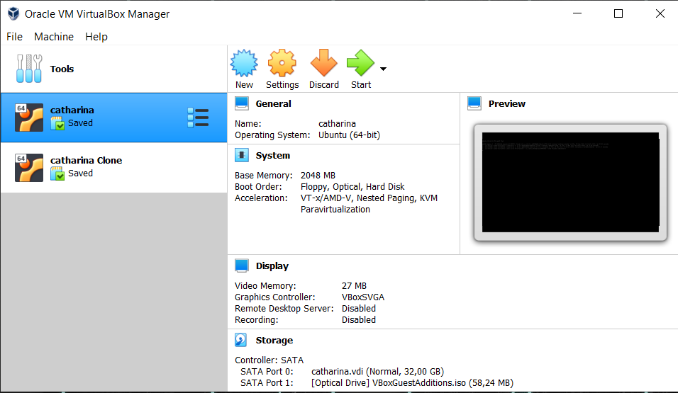
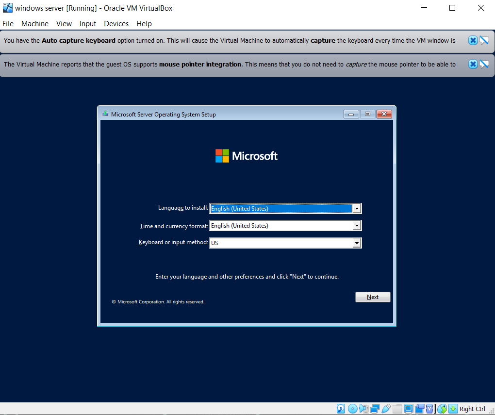

1. Download ISO Installer windows server 2022. Link download tersedia pada e-learning
2. Jika sudah di download, buka virtual box klik machine lalu pilih new dan beri nama. Seperti gambar dibawah ini :

3. Pilih seberapa besar kamu ingin menggunakan storage dan tipe mana yang diinginkan

4. Selanjutnya, pilih machine klik “Network” lalu atur menjadi “Bridge adapter” lalu ok

5. klik Start

6. klik “Start” lalu Windows Server 2022 installation wizard akan loading dan install

7. Pilih lisensi

8. Lalu windows server akan kembali loading

9. Atur password, dan masukan Password yang telah diatur tadi

10. Pilih menu “Devices – Insert Guest Additions CD Image” lalu ikuti alurnya
 
 
 
 
 
11. Masukkan password lagi
 

Instalasi Active Directory Domain Services
1. Lakukan rename terlebih daahulu “rename-computer -Newname Catharina”
 
2. Pilih menu “Server Manager”. Lalu pilih opsi “Manage" dan “Add Roles and Features”. Kemudian klik “Next”.
  
3. Pilih opsi “Role-based or feature-based installation”. dan “Next”
   
4. Klik “Select a server from the server pool” untuk memilih direktori penyimpanan lokal. Lalu “Next”
   
5. Klik tanda centang di kotak “Active Directory Domain Services”. lalu "add features"
   
6.Klik centang kotak “Group Policy Management” lalu “Next”.
   
   

Instalasi DNS Server
1. Pilih menu “Server Manager”. Lalu pilih opsi “Manage" dan “Add Roles and Features”. Kemudian klik “Next”.
   Dan centang kotak pada DNS Server
   
2. Kemudian Centang “.NET Framework 3.5 features”
   
3. Pilih Install dan tunggu hingga selesai
   
   
   
   
Promote Server to a Domain Controller
1. Lakukan Konfigurasi AADS
   
   
   
 2. Buka Ethernet Properties daan atur seperti dibawah ini :
   
 3. Buka Notifikasinya
   
 4. Klik “Add a new forest” dan masukkan nama domain yang akan digunakan pada Root Domain Name
   
 5. Klik “Windows Server 2016” pada functional level, dan centang “Domain Name System (DNS) server” dan ”Global Catalog"
    Lalu atur Password
    
 6. Isi nama “The NetBIOS domain name” sesuai dengan nama domain
    
 7. Pilih Next
    
 8. Dan.... Berakhir di step ini, karena punya saya error
    
    
    
 Terima Kaish telah membuka dan membaca page ini sampai selesai. Jika ada kesalahan dan ketidak tepatan 
 dalam hal waktu pengumpulan, ssaya ucapkan Mohon Maaf :)
